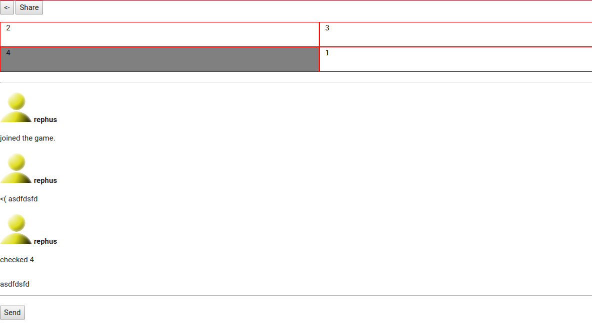

## Party Bingo

*Work in progress*

Web app built entirely with websockets that allows people to
create bingo boards based on events of the party, so others can join.

Boards and/or games can be public to everyone.



## Run

```
npm install
node server.js
```

Run `client.hmtl` on your browser to start sending requests to `localhost:8001`.

See `websocket.js` for client details.


## Basic concepts

* Board : List of events to form a board, it has no shape or checked values
* Bingo: Instance of the board, with a fixed number of rows and colums depending of the length of the events (mostly squared, from 2x2 to 5x5). Every event has a value saying if it was checked (by the user) or not.
* Chat: List of events that happens in the game plus messages from peopel within the game.
* Game: Collection of players with bingos, and a chat. It also contains a sampleBingo object so people can see how it looks like from the menu.

Boards can be cloned, but there is only 1 game per board.

## Data schema
```
boards {
  uuid: {
    id:uuid,
    events: [ <string> ],
    author: <string>,
    share: <boolean>,
    authorName:  <boolean>
  }
};
```

```
games {
  uuid:  {
    id: uuid,
    board: <board>,
    chat: [ {avatar:  <string>,
      name: <string>,
      message: <string>}],
    players: {
      'uuid': {
        id: <string>,
        bingo: {
          rows: <int>,
          colums: <int>,
          events: [ { value: <string>, checked: <boolean>} ]
        }
      }
    },
    private: <boolean>
};
```
